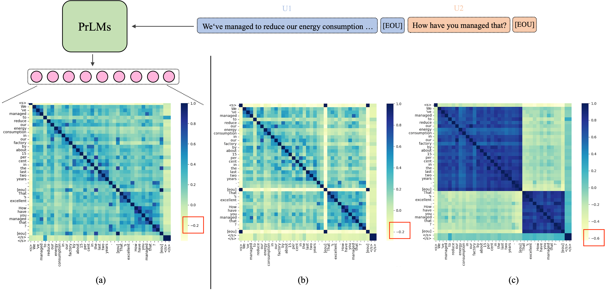

# SimDRC

Official code of the paper [Learning Locality and Isotropy in Dialogue Modeling](https://arxiv.org/abs/2205.14583).

## Introduction

Existing dialogue modeling methods have achieved promising performance on various dialogue tasks with the aid
of Transformer and the large-scale pre-trained language models. However, some recent studies revealed that 
the context representations produced by these methods suffer the problem of ***anisotropy***. In this 
paper, we find that the generated representations are also not ***conversational***, losing the 
conversation structure information during the context modeling stage. To this end, we identify two 
properties in dialogue modeling, i.e., locality and isotropy, and present a simple method for dialogue 
representation calibration, namely SimDRC, to build isotropic and conversational feature spaces.
Experimental results show that our approach significantly outperforms the current state-of-the-art 
models on three dialogue tasks across the automatic and human evaluation metrics. More in-depth analyses 
further confirm the effectiveness of our proposed approach.



The above figure shows the cosine similarity of token representations produced by the well-trained (a) 
vallina BART (b) SimCTG and (c) SimDRC.

We evaluate our method on three dialogue tasks, including response generation, multi-turn response retrieval 
and conversational semantic role labeling. Find detailed implementations in corresponding dir.

## Citation
```
@article{wu2022learning,
  title={Learning Locality and Isotropy in Dialogue Modeling},
  author={Wu, Han and Tan, Haochen and Zhan, Mingjie and Zhao, Gangming and Lu, Shaoqing and Liang, Ding and Song, Linqi},
  journal={arXiv preprint arXiv:2205.14583},
  year={2022}
}
```

